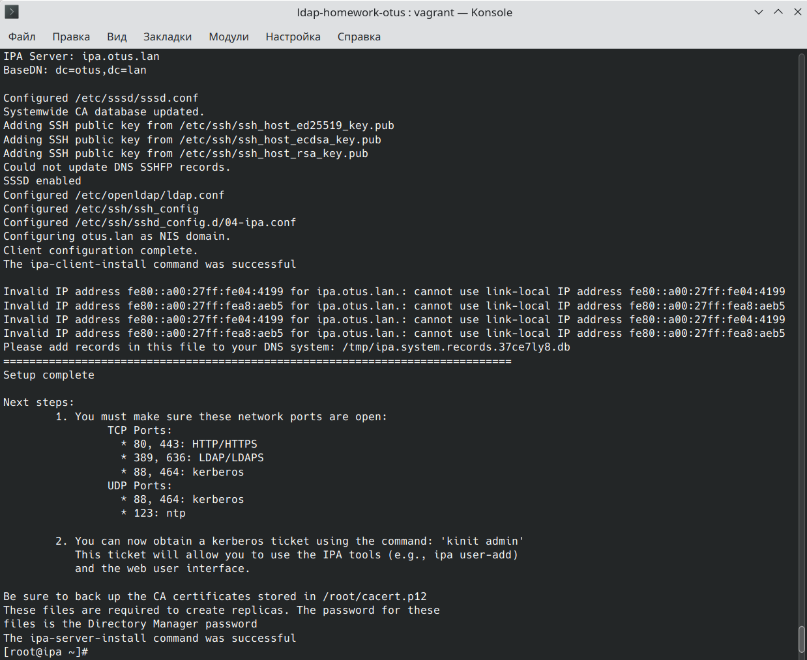
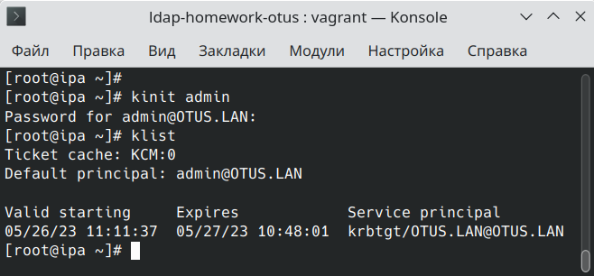
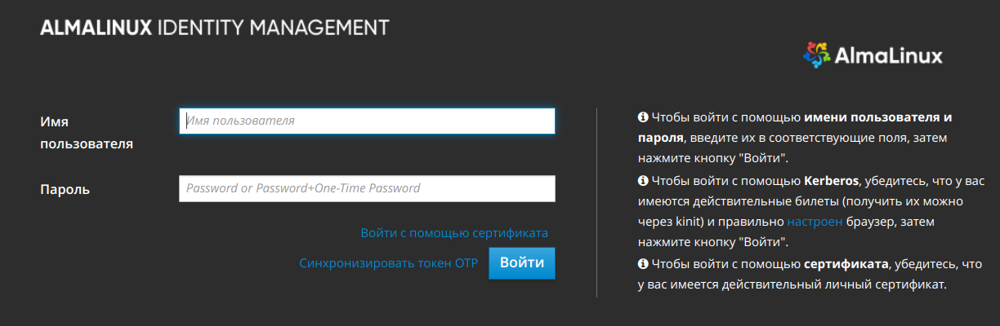
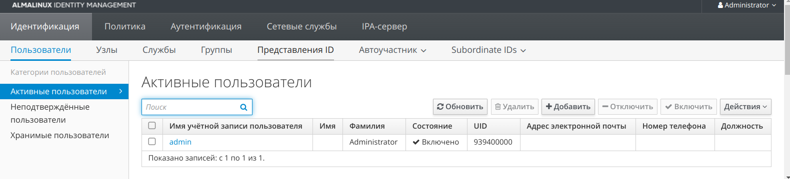
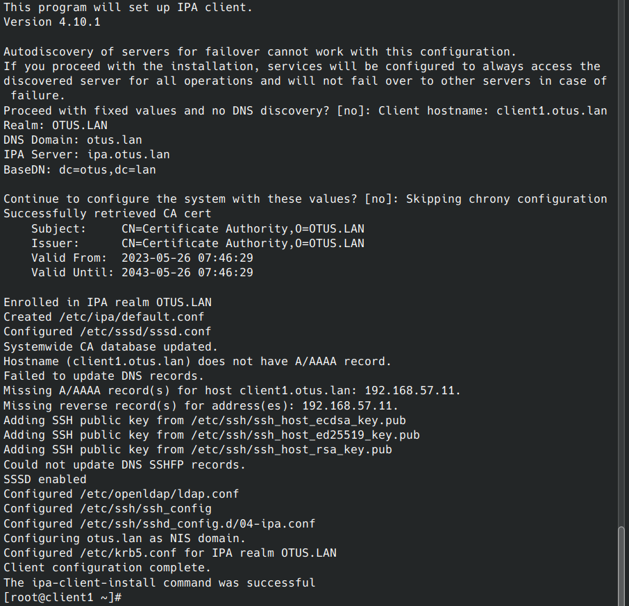
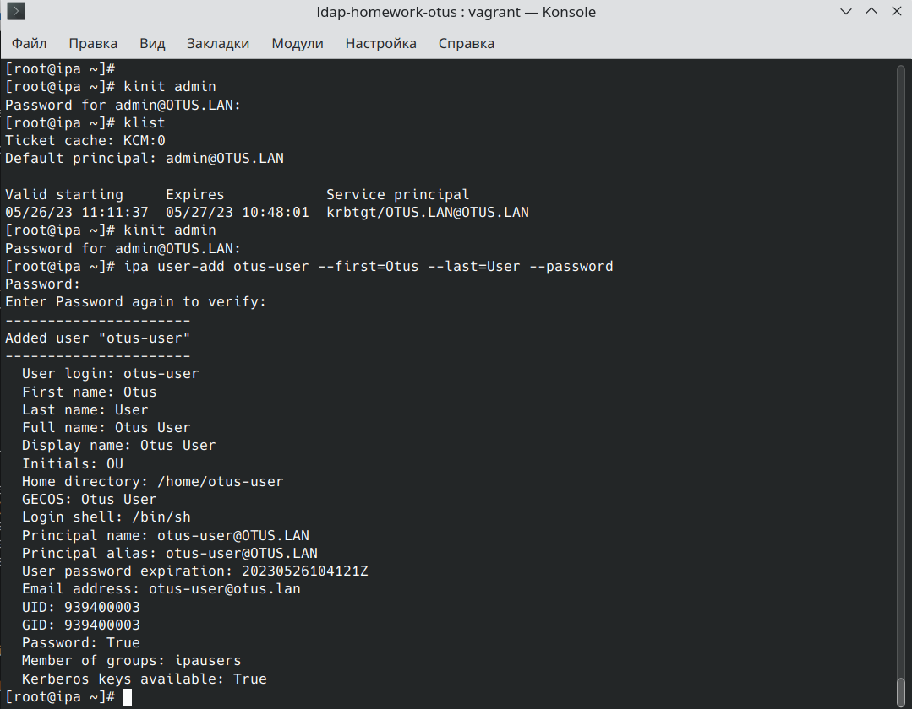
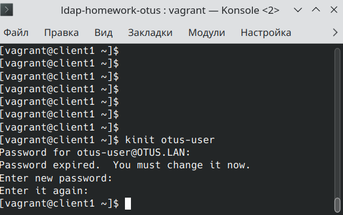

<h2>1) Установить FreeIPA</h2>
Поднятие сервера:

```bash
vagrant up ipa.otus.lan
```

Установка сервера до момента использования скрипта ipa-server-install проходит при помощи плейбука<br>

Использую скрипт установки сервера:<br>

```bash
ipa-server-install

Do you want to configure integrated DNS (BIND)? [no]: no
Server host name [ipa.otus.lan]: <Нажимем Enter>
Please confirm the domain name [otus.lan]: <Нажимем Enter>
Please provide a realm name [OTUS.LAN]: <Нажимем Enter>
Directory Manager password: <Указываем пароль минимум 8 символов>
Password (confirm): <Дублируем указанный пароль>
IPA admin password: <Указываем пароль минимум 8 символов>
Password (confirm): <Дублируем указанный пароль>
NetBIOS domain name [OTUS]: <Нажимем Enter>
```

дождался завершения установки<br>
</img>
    • Directory Manager password — это пароль администратора сервера каталогов, У этого пользователя есть полный доступ к каталогу.<br>
    • IPA admin password — пароль от пользователя FreeIPA admin<br>

После успешной установки FreeIPA, проверил, что сервер Kerberos может выдать мне билет:<br>
</img>
Добавил запись в /etc/hosts на хостовой машине:<br>

```bash
192.168.57.10 ipa.otus.lan
```

открыл веб-страницу https://ipa.otus.lan/<br>
</img>
вошел как admin, появилась веб-консоль управления FreeIPA-сервером<br>
</img>
Установка и настройка сервера завершена.

<h2>2) Написать Ansible-playbook для конфигурации клиента</h2>
Поднятие клиентских машин:

```bash
vagrant up client1.otus.lan client2.otus.lan
```

добавление хоста в доме производится скриптом, аналогичным тому, который производил настройку сервера:

```bash
ipa-client-install
```

получим такой вывод:<br>
</img>


в плейбуке добавление хоста происходит автоматически<br>

Добавление пользователя (зашли на серверную машину):<br>
• Авторизируемся на сервере:

```bash
kinit admin
```

 • Создадим пользователя otus-user

```bash
ipa user-add otus-user --first=Otus --last=User --password
```

Password:     #Вводим пароль пользователя otus-user<br>
Enter Password again to verify: #повторно вводим пароль пользователя otus-user<br>

</img>

На клиентской машине авторизуемся под новым пользователем и меняем пароль:<br>
</img>